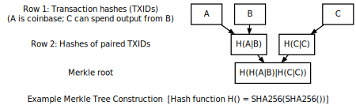
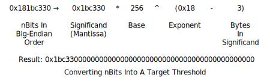

## Block Headers

Block headers are serialized in the 80-byte format described below and then
hashed as part of Pinkcoin's proof-of-work algorithm, making the
serialized header format part of the consensus rules.

| Bytes | Name                | Data Type | Description
|-------|---------------------|-----------|----------------
| 4     | nVersion             |  int  | The block version number indicates which set of block validation rules to follow. See the list of block versions below.
| 32    | hashPrevBlock | uint256  | A SHA256(SHA256()) hash in internal byte order of the previous block's header.  This ensures no previous block can be changed without also changing this block's header.
| 32    | hashMerkleRoot    | uint256  | A SHA256(SHA256()) hash in internal byte order. The merkle root is derived from the hashes of all transactions included in this block, ensuring that none of those transactions can be modified without modifying the header.  See the merkle trees section below.
| 4     | nTime                | unsigned int  | The block time is a Unix epoch time when the miner started hashing the header (according to the miner).  Must be strictly greater than the median time of the previous 11 blocks.  Full nodes will not accept blocks with headers more than two hours in the future according to their clock.
| 4     | nBits               | unsigned int  | An encoded version of the target threshold this block's header hash must be less than or equal to.  See the nBits format described below.
| 4     | nNonce               | unsigned int  | An arbitrary number miners change to modify the header hash in order to produce a hash less than or equal to the target threshold.  If all 32-bit values are tested, the time can be updated or the coinbase transaction can be changed and the merkle root updated.

The hashes are in internal byte order; the other values are all
in little-endian order.

An example header in hex:

```
02000000 ........................... Block version: 2

b6ff0b1b1680a2862a30ca44d346d9e8
910d334beb48ca0c0000000000000000 ... Hash of previous block's header
9d10aa52ee949386ca9385695f04ede2
70dda20810decd12bc9b048aaab31471 ... Merkle root

24d95a54 ........................... Unix time: 1415239972
30c31b18 ........................... Target: 0x1bc330 * 256**(0x18-3)
fe9f0864 ........................... Nonce
```

## Block Versions

* **Version 1** was introduced in the genesis block of the current Pinkcoin blockchain (Pinkcoin migrated to this new blockchain on March 8, 2017).

## Merkle Trees

The merkle root is constructed using all the TXIDs of transactions in
this block, but first the TXIDs are placed in order as required by the
consensus rules:

* The coinbase transaction's TXID is always placed first.

* Any input within this block can spend an output which also appears in
  this block (assuming the spend is otherwise valid). However, the TXID
  corresponding to the output must be placed at some point before the
  TXID corresponding to the input. This ensures that any program parsing
  block chain transactions linearly will encounter each output before it
  is used as an input.

If a block only has a coinbase transaction, the coinbase TXID is used as
the merkle root hash.

If a block only has a coinbase transaction and one other transaction,
the TXIDs of those two transactions are placed in order, concatenated as
64 raw bytes, and then SHA256(SHA256()) hashed together to form the
merkle root.

If a block has three or more transactions, intermediate merkle tree rows
are formed. The TXIDs are placed in order and paired, starting with the
coinbase transaction's TXID. Each pair is concatenated together as 64
raw bytes and SHA256(SHA256()) hashed to form a second row of
hashes. If there are an odd (non-even) number of TXIDs, the last TXID is
concatenated with a copy of itself and hashed. If there are more than
two hashes in the second row, the process is repeated to create a third
row (and, if necessary, repeated further to create additional rows).
Once a row is obtained with only two hashes, those hashes are concatenated and
hashed to produce the merkle root..



TXIDs and intermediate hashes are always in internal byte order when they're
concatenated, and the resulting merkle root is also in internal byte
order when it's placed in the block header.

## Target nBits

The target threshold is a 256-bit unsigned integer which a header hash
must be equal to or below in order for that header to be a valid part of
the block chain.
However, the header field *nBits* provides only 32 bits of space, so the
target number uses a less precise format called "compact" which works
like a base-256 version of scientific notation:



As a base-256 number, nBits can be quickly parsed as bytes the same way
you might parse a decimal number in base-10 scientific notation:


Although the target threshold should be an unsigned integer, the
original nBits implementation inherits properties from a signed data
class, allowing the target threshold to be negative if the high bit of
the significand is set. This is useless---the header hash is
treated as an unsigned number, so it can never be equal to or lower than a
negative target threshold. Pinkcoin Core deals with this in two ways:

* When parsing nBits, Pinkcoin Core converts a negative target
  threshold into a target of zero, which the header hash can equal (in
  theory, at least).

* When creating a value for nBits, Pinkcoin Core checks to see if it will
  produce an nBits which will be interpreted as negative; if so, it
  divides the significand by 256 and increases the exponent by 1 to
  produce the same number with a different encoding.

Some examples taken from the Pinkcoin Core test cases:

| nBits      |  Target          | Notes
|------------|------------------|----------------
| 0x01003456 | &nbsp;0x00       |
| 0x01123456 | &nbsp;0x12       |
| 0x02008000 | &nbsp;0x80       |
| 0x05009234 | &nbsp;0x92340000 |
| 0x04923456 | -0x12345600      | High bit set (0x80 in 0x92).
| 0x04123456 | &nbsp;0x12345600 | Inverse of above; no high bit.

Difficulty 1, the minimum allowed difficulty, is represented on mainnet
and the current testnet by the nBits value 0x1d00ffff. Regtest mode uses
a different difficulty 1 value---0x207fffff, the highest possible value
below uint32_max which can be encoded; this allows near-instant building
of blocks in regtest mode.

## Serialized Blocks

Under current consensus rules, a block is not valid unless its
serialized size is less than or equal to 1 MB. All fields described
below are counted towards the serialized size.

| Bytes    | Name         | Data Type        | Description
|----------|--------------|------------------|--------------
| 80       | block header | block_header     | The block header in the format described in the [block header section](#block-headers).
| *Varies* | txn_count    | compactSize uint | The total number of transactions in this block, including the coinbase transaction.
| *Varies* | txns         | raw transaction  | Every transaction in this block, one after another, in raw transaction format.  Transactions must appear in the data stream in the same order their TXIDs appeared in the first row of the merkle tree.  See the [merkle tree section](#merkle-trees) for details.

The first transaction in a block must be a coinbase
transaction which should collect and
spend any transaction fees paid by transactions included in this block.

All blocks with a block height less than 6,930,000 are entitled to
receive a block subsidy of newly created pinkcoin value, which also
should be spent in the coinbase transaction. (The block subsidy started
at 50 pinkcoins and is being halved every 210,000 blocks---approximately
once every four years. As of November 2017, it's 12.5 pinkcoins.)

Together, the transaction fees and block subsidy are called the block
reward. A coinbase transaction is
invalid if it tries to spend more value than is available from the
block reward.


