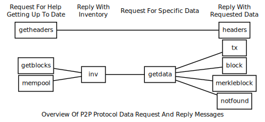
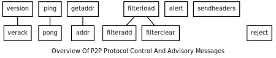

This section describes the Pinkcoin P2P network protocol (but it is not a
specification).

All peer-to-peer communication occurs entirely over TCP.

**Note:** unless their description says otherwise, all multi-byte
integers mentioned in this section are transmitted in little-endian order.

## Constants And Defaults

| Network | Default Port | Start String | Max nBits
|---------|--------------|--------------------------------------|-----
| Mainnet | 9134         | f2f4f9fb                                    | -
| Testnet | 19134        | 0204050d                                   | -

Command line parameters can change what port a node listens on (see
`-help`). Start strings are hardcoded constants that appear at the start
of all messages sent on the Pinkcoin network; they may also appear in
data files such as Pinkcoin's block database.  The nBits displayed
above are in big-endian order; they're sent over the network in
little-endian order.

## Protocol Versions

The table below lists some notable versions of the P2P network protocol,
with the most recent versions listed first. (If you know of a protocol
version that implemented a major change but which is not listed here,
please open an issue.)

As of Pinkcoin v2.1.0.4 , the most recent protocol version is 60014.

| Version | Initial Release                    | Major Changes
|---------|------------------------------------|--------------
| 60014   | Pinkcoin v2.1.0.3 | Hardforking Network Attack Bug-fix ([Details](https://medium.com/@cryptocayce/incident-pinkcoin-network-attack-9f6bbe5048b6))

## Message Headers

All messages in the network protocol use the same container format,
which provides a required multi-field message header and an optional payload.
The message header format is:

| Bytes | Name         | Data Type | Description
|-------|--------------|-----------|-------------
| 4     | start string | char[4]   | Magic bytes indicating the originating network; used to seek to next message when stream state is unknown.
| 12    | command name | char[12]  | ASCII string which identifies what message type is contained in the payload.  Followed by nulls (0x00) to pad out byte count; for example: `version\0\0\0\0\0`.
| 4     | payload size | uint32_t  | Number of bytes in payload.  The current maximum number of bytes (`MAX_SIZE`) allowed in the payload by Bitcoin Core is 32 MiB---messages with a payload size larger than this will be dropped or rejected.
| 4     | checksum     | char[4]   | First 4 bytes of SHA256(SHA256(payload)) in internal byte order. If payload is empty, as in `verack` and `getaddr` messages, the checksum is always 0x5df6e0e2 (SHA256(SHA256(\<empty string>))).

The following example is an annotated hex dump of a mainnet message
header from a `verack` message which has no payload.

```
f2f4f9fb ................... Start string: Mainnet
76657261636b000000000000 ... Command name: verack + null padding
00000000 ................... Byte count: 0
5df6e0e2 ................... Checksum: SHA256(SHA256(<empty>))
```
<!-- main.cpp line 2942 - ProcessMessage function -->

## Data Messages

The following network messages all request or provide data related to
transactions and blocks.



Many of the data messages use
inventories as unique identifiers
for transactions and blocks.  Inventories have a simple 36-byte
structure:

| Bytes | Name            | Data Type | Description
|-------|-----------------|-----------|-------------
| 4     | type identifier | uint32_t  | The type of object which was hashed.  See list of type identifiers below.
| 32    | hash            | char[32]  | SHA256(SHA256()) hash of the object in internal byte order.

The currently-available type identifiers are:

| Type Identifier | Name                                                                          | Description
|-----------------|-------------------------------------------------------------------------------|---------------
| 1               | `MSG_TX`                                     | The hash is a TXID.
| 2               | `MSG_BLOCK`                            | The hash is of a block header.

Type identifier zero and type identifiers greater than two are reserved
for future implementations. Pinkcoin ignores all inventories with
one of these unknown types.

### Block

The `block` message transmits a single serialized block in the format
described in the [serialized blocks section](/block-chain/#serialized-blocks).
See that section for an example hexdump.  It can be sent for two
different reasons:

1. **GetData Response:** Nodes will always send it in response to a
   `getdata` message that requests the block with an inventory
   type of `MSG_BLOCK` (provided the node has that block available for
   relay).

2. **Unsolicited:** Some miners will send unsolicited `block` messages
   broadcasting their newly-mined blocks to all of their peers. Many
   mining pools do the same thing, although some may be misconfigured to
   send the block from multiple nodes, possibly sending the same block
   to some peers more than once.

### GetBlocks

The `getblocks` message requests an `inv` message that provides block
header hashes starting from a particular point in the block chain. It
allows a peer which has been disconnected or started for the first time
to get the data it needs to request the blocks it hasn't seen.

Peers which have been disconnected may have stale blocks in their
locally-stored block chain, so the `getblocks` message allows the
requesting peer to provide the receiving peer with multiple header
hashes at various heights on their local chain. This allows the
receiving peer to find, within that list, the last header hash they had
in common and reply with all subsequent header hashes.

Note: the receiving peer itself may respond with an `inv` message
containing header hashes of stale blocks.  It is up to the requesting
peer to poll all of its peers to find the best block chain.

If the receiving peer does not find a common header hash within the
list, it will assume the last common block was the genesis block (block
zero), so it will reply with in `inv` message containing header hashes
starting with block one (the first block after the genesis block).

| Bytes    | Name                 | Data Type        | Description
|----------|----------------------|------------------|----------------
| 4        | version              | uint32_t         | The protocol version number; the same as sent in the `version` message.
| *Varies* | hash count           | compactSize uint | The number of header hashes provided not including the stop hash.  There is no limit except that the byte size of the entire message must be below the `MAX_SIZE` limit; typically from 1 to 200 hashes are sent.
| *Varies* | block header hashes  | char[32]         | One or more block header hashes (32 bytes each) in internal byte order.  Hashes should be provided in reverse order of block height, so highest-height hashes are listed first and lowest-height hashes are listed last.
| 32       | stop hash            | char[32]         | The header hash of the last header hash being requested; set to all zeroes to request an `inv` message with all subsequent header hashes (a maximum of 500 will be sent as a reply to this message; if you need more than 500, you will need to send another `getblocks` message with a higher-height header hash as the first entry in block header hash field).

The following annotated hexdump shows a `getblocks` message.  (The
message header has been omitted.)

```
71110100 ........................... Protocol version: 70001
02 ................................. Hash count: 2

d39f608a7775b537729884d4e6633bb2
105e55a16a14d31b0000000000000000 ... Hash #1

5c3e6403d40837110a2e8afb602b1c01
714bda7ce23bea0a0000000000000000 ... Hash #2

00000000000000000000000000000000
00000000000000000000000000000000 ... Stop hash
```

### GetData

The `getdata` message requests one or more data objects from another
node. The objects are requested by an inventory, which the requesting
node typically received previously by way of an `inv` message.

The response to a `getdata` message can be a `tx` message, `block`
message, `merkleblock` message, or `notfound` message.

This message cannot be used to request arbitrary data, such as historic
transactions no longer in the memory pool or relay set. Full nodes may
not even be able to provide older blocks if they've pruned old
transactions from their block database. For this reason, the `getdata`
message should usually only be used to request data from a node which
previously advertised it had that data by sending an `inv` message.

The format and maximum size limitations of the `getdata` message are
identical to the `inv` message; only the message header differs.

### GetHeaders

The `getheaders` message requests a `headers` message that provides block headers
starting from a particular point in the block chain. It allows a
peer which has been disconnected or started for the first time to get
the headers it hasn’t seen yet.

The `getheaders` message is nearly identical to the `getblocks` message,
with one minor difference: the `inv` reply to the `getblocks` message
will include no more than 500 block header hashes; the `headers` reply
to the `getheaders` message will include as many as 2,000 block headers.


#### Headers

The `headers` message sends block headers to a node which
previously requested certain headers with a `getheaders` message. A headers
message can be empty.

| Bytes    | Name    | Data Type        | Description
|----------|---------|------------------|-----------------
| *Varies* | count   | compactSize uint | Number of block headers up to a maximum of 2,000.  Note: headers-first sync assumes the sending node will send the maximum number of headers whenever possible.
| *Varies* | headers | block_header     | Block headers: each 80-byte block header is in the format described in the [block headers section](/block-chain/#block-headers) with an additional 0x00 suffixed.  This 0x00 is called the transaction count, but because the headers message doesn't include any transactions, the transaction count is always zero.

The following annotated hexdump shows a `headers` message.  (The message
header has been omitted.)

```
01 ................................. Header count: 1

02000000 ........................... Block version: 2
b6ff0b1b1680a2862a30ca44d346d9e8
910d334beb48ca0c0000000000000000 ... Hash of previous block's header
9d10aa52ee949386ca9385695f04ede2
70dda20810decd12bc9b048aaab31471 ... Merkle root
24d95a54 ........................... Unix time: 1415239972
30c31b18 ........................... Target (bits)
fe9f0864 ........................... Nonce

00 ................................. Transaction count (0x00)
```

### Inv

The `inv` message (inventory message) transmits one or more inventories of
objects known to the transmitting peer.  It can be sent unsolicited to
announce new transactions or blocks, or it can be sent in reply to a
`getblocks` message or `mempool` message.

The receiving peer can compare the inventories from an `inv` message
against the inventories it has already seen, and then use a follow-up
message to request unseen objects.

| Bytes    | Name      | Data Type             | Description
|----------|-----------|-----------------------|-----------------
| *Varies* | count     | compactSize uint      | The number of inventory entries.
| *Varies* | inventory | inventory             | One or more inventory entries up to a maximum of 50,000 entries.

The following annotated hexdump shows an `inv` message with two
inventory entries.  (The message header has been omitted.)

```
02 ................................. Count: 2

01000000 ........................... Type: MSG_TX
de55ffd709ac1f5dc509a0925d0b1fc4
42ca034f224732e429081da1b621f55a ... Hash (TXID)

01000000 ........................... Type: MSG_TX
91d36d997037e08018262978766f24b8
a055aaf1d872e94ae85e9817b2c68dc7 ... Hash (TXID)
```

### MemPool

The `mempool` message requests the TXIDs of transactions that the
receiving node has verified as valid but which have not yet appeared in
a block. That is, transactions which are in the receiving node's memory
pool. The response to the `mempool` message is one or more `inv`
messages containing the TXIDs in the usual inventory format.

Sending the `mempool` message is mostly useful when a program first
connects to the network. Full nodes can use it to quickly gather most or
all of the unconfirmed transactions available on the network; this is
especially useful for miners trying to gather transactions for their
transaction fees. SPV clients can set a filter before sending a
`mempool` to only receive transactions that match that filter; this
allows a recently-started client to get most or all unconfirmed
transactions related to its wallet.

The `inv` response to the `mempool` message is, at best, one node's
view of the network---not a complete list of unconfirmed transactions
on the network. Here are some additional reasons the list might not
be complete:

* Before Bitcoin Core 0.9.0, the response to the `mempool` message was
  only one `inv` message. An `inv` message is limited to 50,000
  inventories, so a node with a memory pool larger than 50,000 entries
  would not send everything.  Later versions of Bitcoin Core send as
  many `inv` messages as needed to reference its complete memory pool.

* The `mempool` message is not currently fully compatible with the
  `filterload` message's `BLOOM_UPDATE_ALL` and
  `BLOOM_UPDATE_P2PUBKEY_ONLY` flags. Mempool transactions are not
  sorted like in-block transactions, so a transaction (tx2) spending an
  output can appear before the transaction (tx1) containing that output,
  which means the automatic filter update mechanism won't operate until
  the second-appearing transaction (tx1) is seen---missing the
  first-appearing transaction (tx2). It has been proposed in [Bitcoin
  Core issue #2381][] that the transactions should be sorted before
  being processed by the filter.

There is no payload in a `mempool` message.  See the [message header
section][section message header] for an example of a message without a payload.

### Tx

The `tx` message transmits a single transaction in the raw transaction
format. It can be sent in a variety of situations;

* **Transaction Response:** Bitcoin Core and BitcoinJ will send it in
  response to a `getdata` message that requests the transaction with an
  inventory type of `MSG_TX`.

* **MerkleBlock Response:** Bitcoin Core will send it in response to a
  `getdata` message that requests a merkle block with an inventory type
  of `MSG_MERKLEBLOCK`. (This is in addition to sending a `merkleblock`
  message.) Each `tx` message in this case provides a matched
  transaction from that block.

* **Unsolicited:** BitcoinJ will send a `tx` message unsolicited for
  transactions it originates.

For an example hexdump of the raw transaction format, see the [raw
transaction section](#raw-transaction-format).

## Control Messages

The following network messages all help control the connection between
two peers or allow them to advise each other about the rest of the
network.



Note that almost none of the control messages are authenticated in any
way, meaning they can contain incorrect or intentionally harmful
information. In addition, this section does not yet cover P2P protocol
operation over the Tor network; if you would like to contribute
information about Tor, please open an issue.

### Addr

The `addr` (IP address) message relays connection information
for peers on the network. Each peer which wants to accept incoming
connections creates an `addr` message providing its connection
information and then sends that message to its peers unsolicited. Some
of its peers send that information to their peers (also unsolicited),
some of which further distribute it, allowing decentralized peer
discovery for any program already on the network.

An `addr` message may also be sent in response to a `getaddr` message.

| Bytes      | Name             | Data Type          | Description
|------------|------------------|--------------------|----------------
| *Varies*   | IP address count | compactSize uint   | The number of IP address entries up to a maximum of 1,000.
| *Varies*   | IP addresses     | network IP address | IP address entries.  See the table below for the format of a Bitcoin network IP address.

Each encapsulated network IP address currently uses the following structure:

| Bytes | Name       | Data Type | Description
|-------|------------|-----------|---------------
| 4     | time       | uint32    | *Added in protocol version 31402.* <br><br>A time in Unix epoch time format.  Nodes advertising their own IP address set this to the current time.  Nodes advertising IP addresses they've connected to set this to the last time they connected to that node.  Other nodes just relaying the IP address should not change the time.  Nodes can use the time field to avoid relaying old `addr` messages.  <br><br>Malicious nodes may change times or even set them in the future.
| 8     | services   | uint64_t  | The services the node advertised in its `version` message.
| 16    | IP address | char      | IPv6 address in **big endian byte order**. IPv4 addresses can be provided as IPv4-mapped IPv6 addresses
| 2     | port       | uint16_t  | Port number in **big endian byte order**.  Note that Bitcoin Core will only connect to nodes with non-standard port numbers as a last resort for finding peers.  This is to prevent anyone from trying to use the network to disrupt non-Bitcoin services that run on other ports.

The following annotated hexdump shows part of an `addr` message. (The
message header has been omitted and the actual IP address has been
replaced with a RFC5737 reserved IP address.)

```
fde803 ............................. Address count: 1000

d91f4854 ........................... Epoch time: 1414012889
0100000000000000 ................... Service bits: 01 (network node)
00000000000000000000ffffc0000233 ... IP Address: ::ffff:192.0.2.51
208d ............................... Port: 8333

[...] .............................. (999 more addresses omitted)
```

### GetAddr

The `getaddr` message requests an `addr` message from the receiving
node, preferably one with lots of IP addresses of other receiving nodes.
The transmitting node can use those IP addresses to quickly update its
database of available nodes rather than waiting for unsolicited `addr`
messages to arrive over time.

There is no payload in a `getaddr` message.  See the [message header
section][section message header] for an example of a message without a payload.

### Ping

The `ping` message helps confirm that the receiving peer is still
connected. If a TCP/IP error is encountered when sending the `ping`
message (such as a connection timeout), the transmitting node can assume
that the receiving node is disconnected. The response to a `ping`
message is the `pong` message.

Before protocol version 60000, the `ping` message had no payload. As of
protocol version 60001 and all later versions, the message includes a
single field, the nonce.

| Bytes | Name  | Data Type | Description
|-------|-------|-----------|---------------
| 8     | nonce | uint64_t  | *Added in protocol version 60001 as described by BIP31.* <br><br>Random nonce assigned to this `ping` message.  The responding `pong` message will include this nonce to identify the `ping` message to which it is replying.

The annotated hexdump below shows a `ping` message. (The message
header has been omitted.)

```
0094102111e2af4d ... Nonce
```

### Pong

*Added in protocol version 60001 as described by BIP31.*

The `pong` message replies to a `ping` message, proving to the pinging
node that the ponging node is still alive. Bitcoin Core will, by
default, disconnect from any clients which have not responded to a
`ping` message within 20 minutes.

To allow nodes to keep track of latency, the `pong` message sends back
the same nonce received in the `ping` message it is replying to.

The format of the `pong` message is identical to the `ping` message;
only the message header differs.

### VerAck

*Added in protocol version 209.*

The `verack` message acknowledges a previously-received `version`
message, informing the connecting node that it can begin to send
other messages. The `verack` message has no payload; for an example
of a message with no payload, see the [message headers
section][section message header].

### Version

The `version` message provides information about the transmitting node
to the receiving node at the beginning of a connection. Until both peers
have exchanged `version` messages, no other messages will be accepted.

If a `version` message is accepted, the receiving node should send a
`verack` message---but no node should send a `verack` message
before initializing its half of the connection by first sending a
`version` message.

| Bytes    | Name                  | Data Type        | Required/Optional                        | Description
|----------|-----------------------|------------------|------------------------------------------|-------------
| 4        | version               | int32_t          | Required                                 | The highest protocol version understood by the transmitting node.  See the [protocol version section][section protocol versions].
| 8        | services              | uint64_t         | Required                                 | The services supported by the transmitting node encoded as a bitfield.  See the list of service codes below.
| 8        | timestamp             | int64_t          | Required                                 | The current Unix epoch time according to the transmitting node's clock.  Because nodes will reject blocks with timestamps more than two hours in the future, this field can help other nodes to determine that their clock is wrong.
| 8        | addr_recv services    | uint64_t         | Required                                 | The services supported by the receiving node as perceived by the transmitting node.  Same format as the 'services' field above. Bitcoin Core will attempt to provide accurate information.  BitcoinJ will, by default, always send 0.
| 16       | addr_recv IP address  | char             | Required                                 | The IPv6 address of the receiving node as perceived by the transmitting node in **big endian byte order**. IPv4 addresses can be provided as [IPv4-mapped IPv6 addresses][]. Bitcoin Core will attempt to provide accurate information.  BitcoinJ will, by default, always return ::ffff:127.0.0.1
| 2        | addr_recv port        | uint16_t         | Required                                 | The port number of the receiving node as perceived by the transmitting node in **big endian byte order**.
| 8        | addr_trans services   | uint64_t         | Required                                 | *Added in protocol version 106.* <br><br>The services supported by the transmitting node.  Should be identical to the 'services' field above.
| 16       | addr_trans IP address | char             | Required                                 | *Added in protocol version 106.* <br><br>The IPv6 address of the transmitting node in **big endian byte order**. IPv4 addresses can be provided as [IPv4-mapped IPv6 addresses][].  Set to ::ffff:127.0.0.1 if unknown.
| 2        | addr_trans port       | uint16_t         | Required                                 | *Added in protocol version 106.* <br><br>The port number of the transmitting node in **big endian byte order**.
| 8        | nonce                 | uint64_t         | Required                                 | *Added in protocol version 106.* <br><br>A random nonce which can help a node detect a connection to itself.  If the nonce is 0, the nonce field is ignored.  If the nonce is anything else, a node should terminate the connection on receipt<!--noref--> of a `version` message with a nonce it previously sent.
| *Varies* | user_agent bytes      | compactSize uint | Required                                 | *Added in protocol version 106.* <br><br>Number of bytes in following user\_agent field.  If 0x00, no user agent field is sent.
| *Varies* | user_agent            | string           | Required if user_agent bytes > 0         | *Added in protocol version 106. Renamed in protocol version 60000.* <br><br>User agent as defined by BIP14. Previously called subVer.
| 4        | start_height          | int32_t          | Required                                 | *Added in protocol version 209.* <br><br>The height of the transmitting node's best block chain or, in the case of an SPV client, best block header chain.
| 1        | relay                 | bool             | Optional                                 | *Added in protocol version 70001 as described by BIP37.* <br><br>Transaction relay flag.  If 0x00, no `inv` messages or `tx` messages announcing new transactions should be sent to this client until it sends a `filterload` message or `filterclear` message.  If the relay field is not present or is set to 0x01, this node wants `inv` messages and `tx` messages announcing new transactions.

The following service identifiers have been assigned.

| Value | Name         | Description
|-------|--------------|---------------
| 0x00  | *Unnamed*    | This node is not a full node.  It may not be able to provide any data except for the transactions it originates.
| 0x01  | NODE_NETWORK | This is a full node and can be asked for full blocks.  It should implement all protocol features available in its self-reported protocol version.

The following annotated hexdump shows a `version` message. (The
message header has been omitted and the actual IP addresses have been
replaced with [RFC5737][] reserved IP addresses.)

```
72110100 ........................... Protocol version: 70002
0100000000000000 ................... Services: NODE_NETWORK
bc8f5e5400000000 ................... Epoch time: 1415483324

0100000000000000 ................... Receiving node's services
00000000000000000000ffffc61b6409 ... Receiving node's IPv6 address
208d ............................... Receiving node's port number

0100000000000000 ................... Transmitting node's services
00000000000000000000ffffcb0071c0 ... Transmitting node's IPv6 address
208d ............................... Transmitting node's port number

128035cbc97953f8 ................... Nonce

0f ................................. Bytes in user agent string: 15
2f5361746f7368693a302e392e332f ..... User agent: /Satoshi:0.9.3/

cf050500 ........................... Start height: 329167
01 ................................. Relay flag: true
```